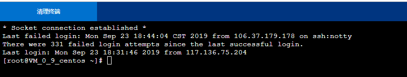

### 实验1.1：购买腾讯云服务器并登录

###### （1）购买腾讯云服务器

###### (2)使用Web Shell登录已购买的云服务器实例 

###### （3）下载安装Xshell（包含在Xmanager中），并使用 Xshell登录腾讯云实例

### 实验 1.2：创建GitHub项目并在本地同步

###### （1） 注册GitHub账号

###### (2)在GitHub上创建云计算项目（CloudComputing）并在 本地同步 

### 实验1.3：本地安装VMware Workstation和CentOS操作系统

###### （1）在VMware WorkStation安装CentOS操作系统 

