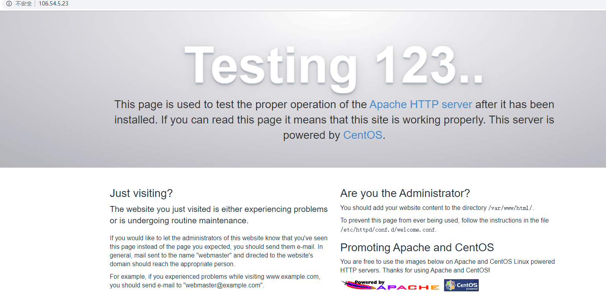
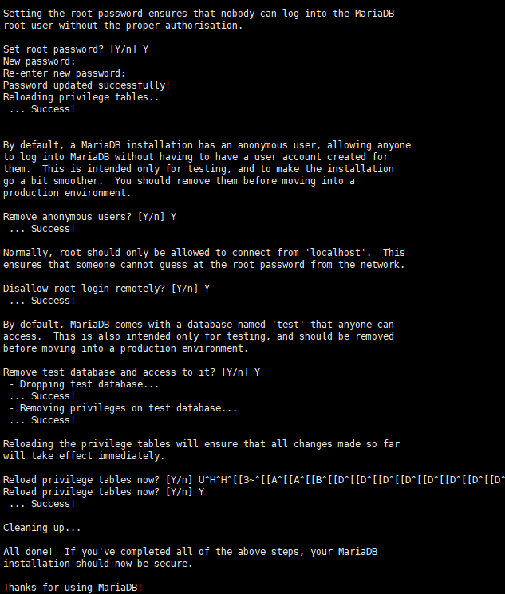
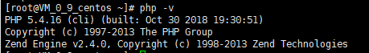
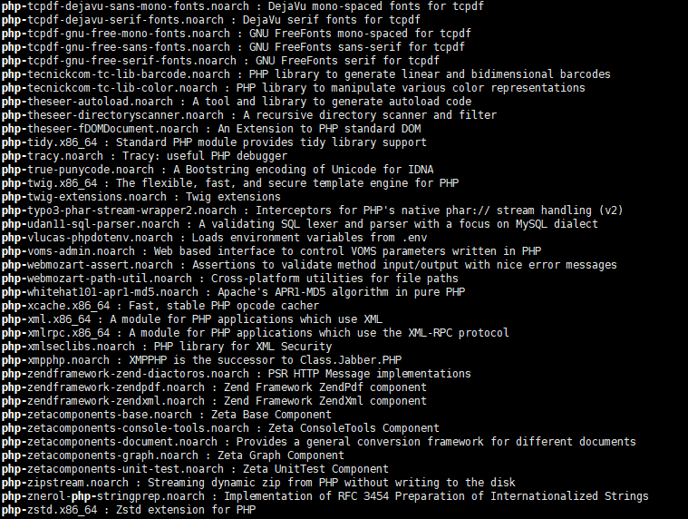
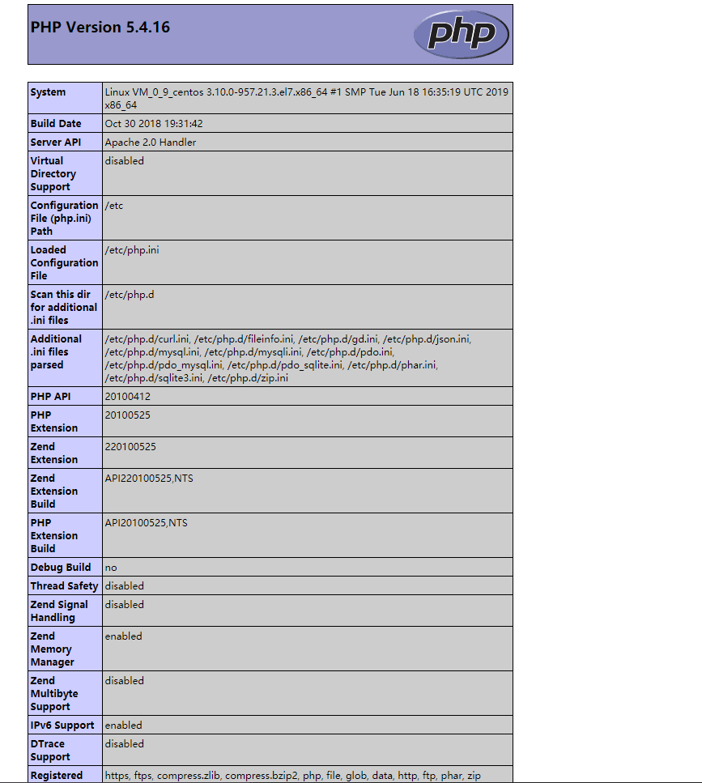
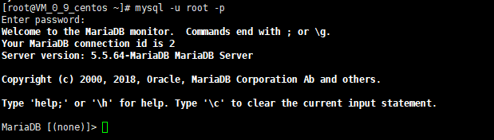
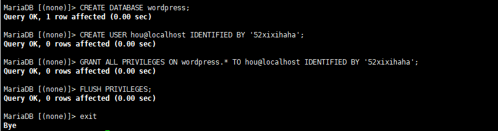
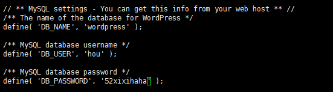
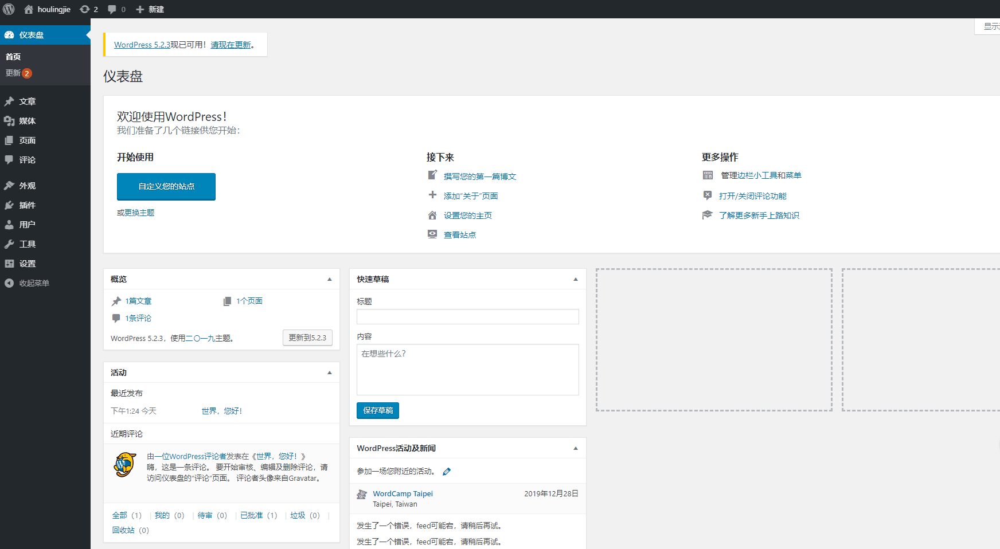

### 实验2.1：使用WordPress创建个人网站 

###### （1）安装Apache Web服务器

###### (2)安装MySQL

###### (3)安装PHP

###### (4)测试PHP

###### (5)安装WordPress以及完成相关配置

​    为WordPress创建一个MySQL数据库

​    安装WordPress

​    配置WordPress

​    通过Web界面进一步配置WordPress

