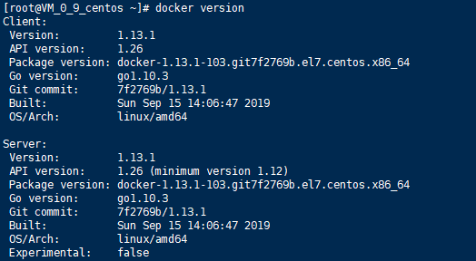
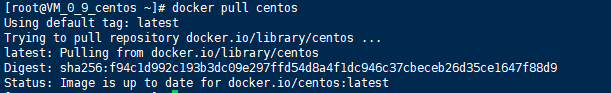

### 实验3.1：安装Docker

###### （1）查看操作系统内核信息：

######           查看Linux的版本号：

######           更新应用程序数据库：

###### （2）安装curl：

###### （3）下载最新的Docker并安装：

###### （4）验证Docker是否成功启动：

###### （5）查看Docker的版本信息：

### 实验3.2：拉取CentOS镜像，并基于该镜像运行容器，在容器实例上完成WordPress的安装，并推送到Docker Hub

###### （1）拉取官方版本(OFFICIAL)的镜像：

###### （2）使用run命令：

###### （3）查看一下当前系统中存在的镜像：

###### （4）连接ssh后使用yum安装：

###### （5）测试：

###### （6）修改数据库用户名、密码、数据库名：

###### （7）注册并登录wordpress：

###### （8）注册登录dockerhub并创建仓库：

###### （9）将带有wordpress的容器制作成镜像：

###### （10）将镜像推送到dockerhub的仓库中：

### 实验3.3：利用Dockerfile创建一个完成WordPress安装的镜像并推送到Docker Hub

###### （1）dockerfile：

###### （2）安装apache、php、mysql:

###### （3）配置数据库:

###### （4）启动apache和mysql：

###### (5)运行dockerfile：

###### （6）生成容器：

###### （7）安装wordpress：

