### 实验4：Ceph的安装与实践 

#### 1.最小化安装四台虚拟机并添加到shell中（方便操作）：

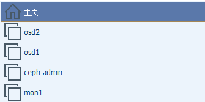

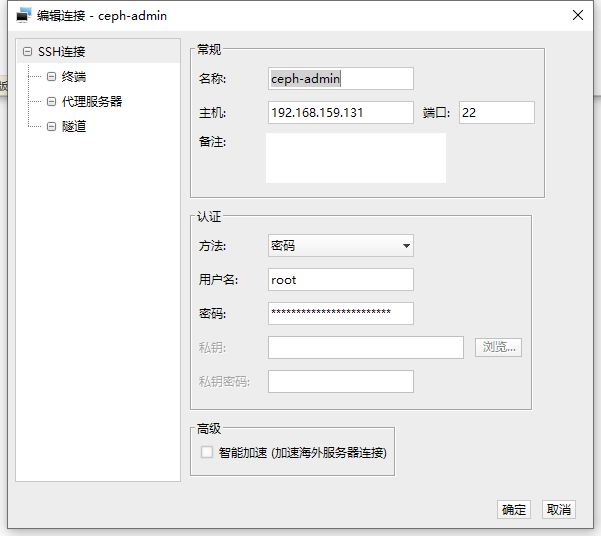

#### 2.配置所有节点：

###### （1）为“ cephuser”配置sudo权限

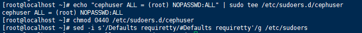

###### （2）安装和配置NTP

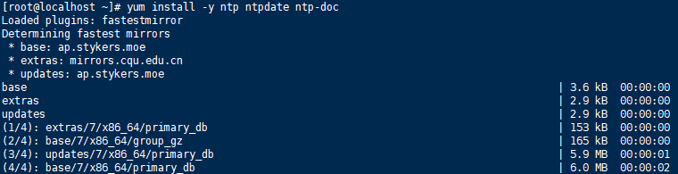

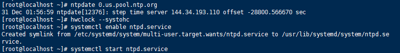

###### （3）安装Open-vm-tools

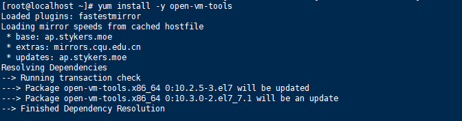

###### （4）禁用SELinux

###### （5）配置主机文件

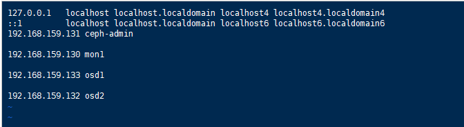

#### 3.配置SSH服务器:

###### (1)在主控节点上设置免密登录并生成ssh密钥

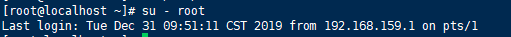

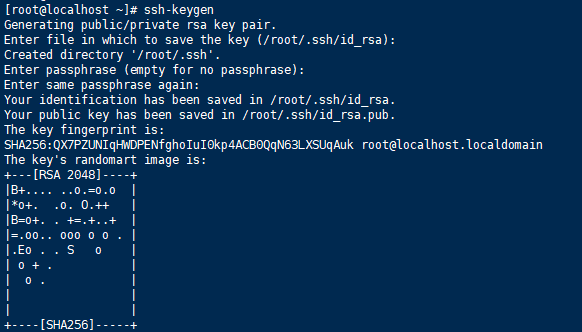

###### (2)为ssh配置创建配置文件

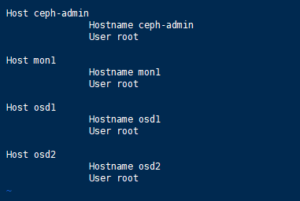

###### （3）使用ssh-copy-id命令将SSH密钥添加到所有节点

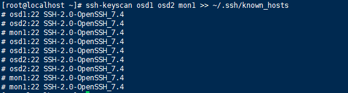

###### （4）分发密钥

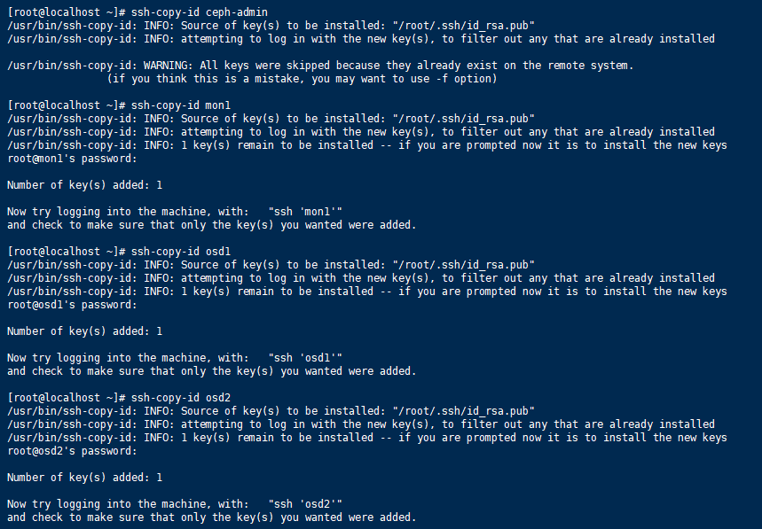

###### (5)测试从ceph-admin访问各节点

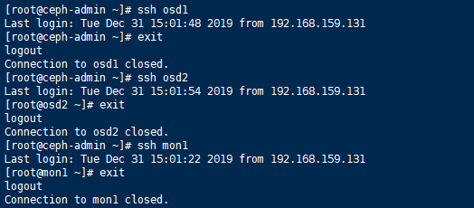

#### 4.配置防火墙：

###### （1）ceph-admin节点防火墙

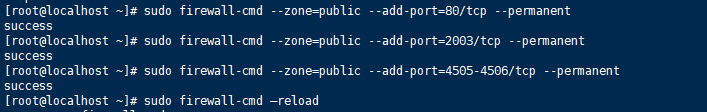

###### (2)mon1防火墙

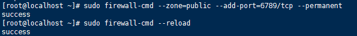

###### （3）osd防火墙

#### 5.构建Ceph集群:

###### (1)在ceph-admin节点上安装ceph-deploy

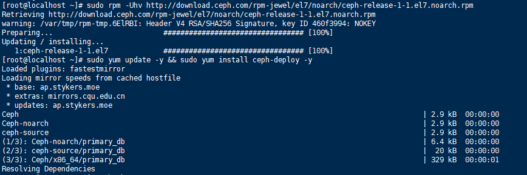

###### (2)使用“ **ceph -deploy** ”命令创建一个新的集群配置，将监视节点定义为“ **mon1** ”

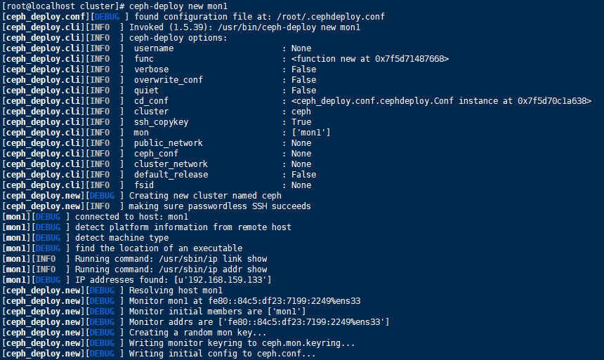

###### (3)编辑ceph.conf文件

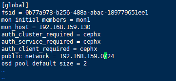

###### (4) 在所有节点上安装Ceph

###### (5)将ceph-mon部署在mon1节点上

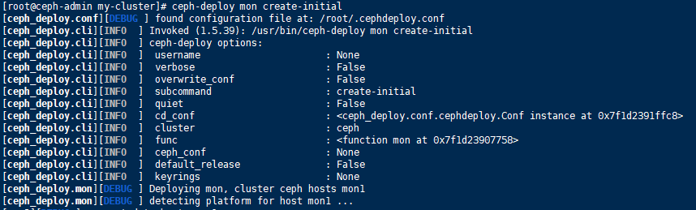

###### (6)创建监视键，并使用“ ceph”命令检查并获取键

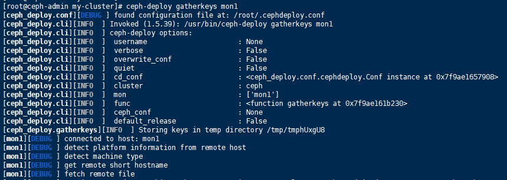

###### (7)为osd守护目录创建进程并赋予权限

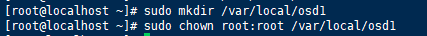

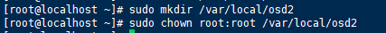

###### （8）将OSDS添加到集群

###### （9）激活OSD

###### （10）将管理密钥部署到所有关联的节点

###### （11）更改密钥文件的权限

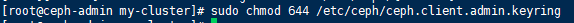

#### 6.测试Ceph设置

###### （1）检查集群运行状况

###### （2）检查集群状态

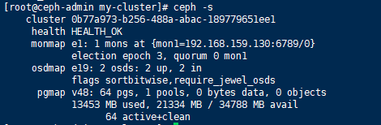